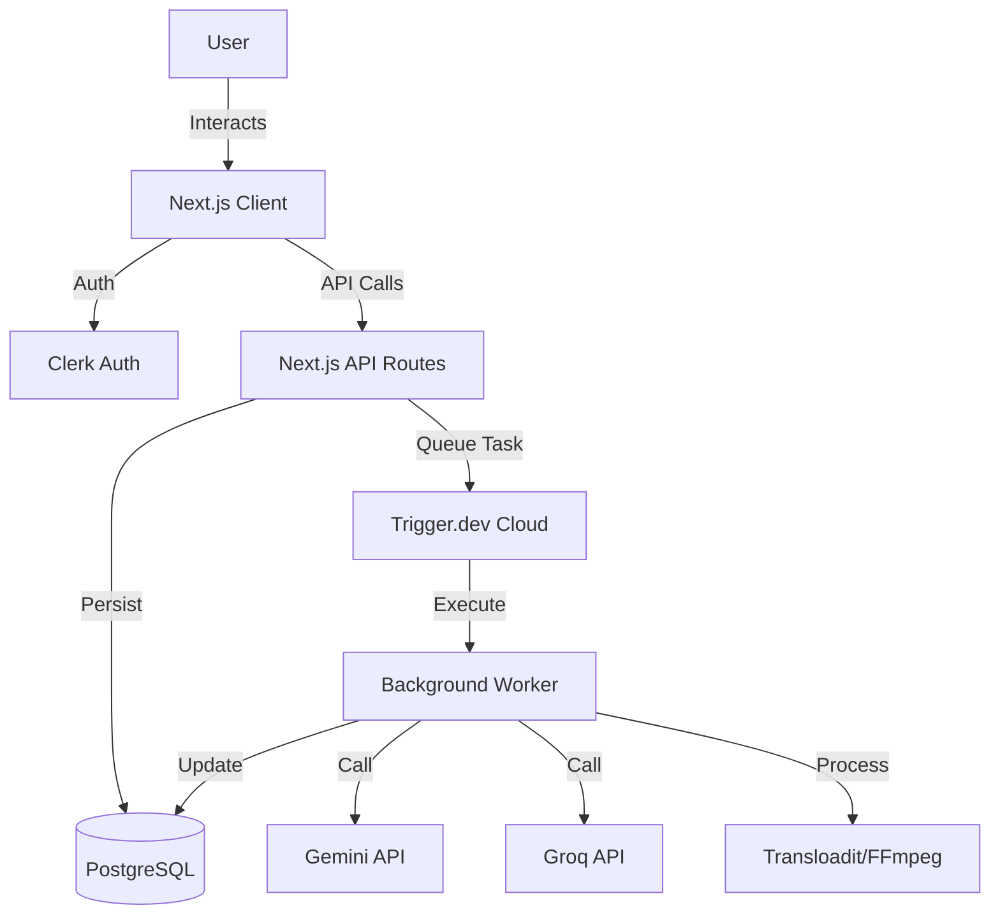

<div align="center">

# 🌌 Weavy-Clone — Artistic Intelligence

### *Turn your creative vision into scalable workflows.*

[](https://nextjs.org/)
[](https://react.dev/)
[](https://typescriptlang.org/)
[](https://tailwindcss.com/)
[](https://prisma.io/)
[](https://trigger.dev/)

---

**Weavy-Clone** is a node-based AI workflow platform that lets creators, designers, and developers visually compose powerful AI pipelines — connecting models like **Gemini**, **Llama**, **Qwen**, and **FFmpeg** processing — all within a stunning, drag-and-drop canvas.

[Get Started](#-getting-started) · [Features](#-features) · [Architecture](#-architecture) · [Tech Stack](#-tech-stack)

</div>

---

## ✨ Features

### � Core Capabilities
- **🎨 Node-Based Editor**: Drag-and-drop visual workflow builder with infinite canvas, powered by React Flow.
- **🤖 LLM Integration**: Execute complex prompts with **Google Gemini**, **Groq (Llama, Qwen)**, and more.
- **🖼️ Image Processing**: Smart cropping and optimization pipelines.
- **🎬 Video Analysis**: Extract frames and process video content via FFmpeg.
- **🔗 Visual Pipelines**: Connect nodes to build complex AI workflows with input chaining.
- **⚡ Real-Time Execution**: See nodes light up and pulse as they process data in real-time.

### �️ Production Features
- **✅ React Flow Integration**: Industry-standard node editor with smooth pan/zoom and mini-map.
- **✅ Trigger.dev Background Tasks**: serveless, long-running processes for reliable AI execution.
- **✅ Clerk Authentication**: Secure, seamless user management and route protection.
- **✅ PostgreSQL Storage**: Persistent workflow saving, history tracking, and user data via Prisma.
- **✅ Responsive Design**: Fully responsive UI working on desktop, tablets, and mobile.
- **✅ Dark Theme**: Beautiful, modern dark UI designed for focus and creativity.

---

## 📋 Table of Contents
- [Architecture](#-architecture)
- [Prerequisites](#-prerequisites)
- [Installation](#-installation)
- [Quick Start](#-quick-start)
- [Node Types](#-node-types)
- [Configuration](#-configuration)
- [API Documentation](#-api-documentation)
- [Troubleshooting](#-troubleshooting)
- [Project Structure](#-project-structure)
- [Deployment](#-deployment)
- [Contributing](#-contributing)

---

## 🏗️ Architecture

Galaxy.ai follows a modern, scalable architecture:

### The Three Pillars
| Layer | Name | Technology | Responsibility |
|-------|------|------------|----------------|
| **UI** | The Canvas | React + React Flow | Visual node editor, state management (Zustand) |
| **Logic** | The Orchestrator | Next.js API | Graph interpretation, CRUD operations, Authentication |
| **Compute** | The Engine | Trigger.dev | Long-running tasks (LLM calls, FFmpeg processing) |

### Component Overview
| Service | Port | Tech Stack | Key Dependencies |
|---------|------|------------|------------------|
| **Frontend** | 3000 | Next.js, React | @xyflow/react, Tailwind CSS, Framer Motion |
| **Database** | 5432 | PostgreSQL | Prisma ORM |
| **Task Queue** | - | Trigger.dev | @trigger.dev/sdk, FFmpeg, Gemini SDK |

### Architecture Diagram


---

## 📦 Prerequisites

### Required Software
- **Node.js 18+**
  ```bash
  node --version  # Should be 18.x or higher
  ```
- **PostgreSQL 14+** (Local or Cloud like Supabase/Neon)
- **Git**

### API Keys
1. **[Clerk](https://clerk.com)**: For authentication.
2. **[Trigger.dev](https://trigger.dev)**: For background task execution.
3. **[Google AI Studio](https://aistudio.google.com/)**: For Gemini models.
4. **[Groq](https://console.groq.com)**: For high-speed LLM inference.
5. **[Transloadit](https://transloadit.com)**: For file upload handling.

---

## 🚀 Installation

1. **Clone the Repository**
   ```bash
   git clone https://github.com/ShreyasUrade1123/Weavy-Clone-Version1.git
   cd Weavy-Clone-Version1
   ```

2. **Install Dependencies**
   ```bash
   npm install
   ```

3. **Database Setup**
   Ensure your `DATABASE_URL` is set in `.env` (see Configuration), then run:
   ```bash
   npx prisma generate
   npx prisma db push
   ```

4. **Configure Environment**
   Duplicate `.env.example` to `.env` and fill in your keys.

---

## ⚡ Quick Start

Start all services to get the application running locally.

**Terminal 1 - Dev Server** (Frontend + API):
```bash
npm run dev
# ✅ App running on http://localhost:3000
```

**Terminal 2 - Trigger.dev Agent** (Background Worker):
```bash
npx trigger.dev@latest dev
# ✅ Connected to Trigger.dev cloud, listening for tasks
```

Access the app at [http://localhost:3000](http://localhost:3000).

---

## 🧩 Node Types

Galaxy.ai provides a library of specialized nodes to build your workflows:

### Input Nodes
| Node | Description | Output |
|------|-------------|--------|
| **Text** | Manual text input for prompts and system instructions | Text string |
| **Upload Image** | Drag & drop image upload (via Transloadit) | Image URL |
| **Upload Video** | Video file upload support | Video URL |

### Processing Nodes
| Node | Description | Inputs → Output |
|------|-------------|-----------------|
| **LLM** | Run prompts against models like Gemini 1.5 or Llama 3 | System Prompt + User Message + Images → Text |
| **Crop Image** | Smart cropping using FFmpeg | Image + Dimensions → Cropped Image URL |
| **Extract Frame** | Extract a specific frame from a video | Video URL + Timestamp → Image URL |

---

## ⚙️ Configuration

Create a `.env` file in the root directory with the following variables:

| Variable | Description | Required |
|----------|-------------|----------|
| `DATABASE_URL` | PostgreSQL connection string | ✅ |
| `NEXT_PUBLIC_CLERK_PUBLISHABLE_KEY` | Clerk public key | ✅ |
| `CLERK_SECRET_KEY` | Clerk secret key | ✅ |
| `TRIGGER_SECRET_KEY` | Trigger.dev secret key | ✅ |
| `NEXT_PUBLIC_TRIGGER_PUBLIC_API_KEY` | Trigger.dev public key | ✅ |
| `TRIGGER_PROJECT_ID` | Trigger.dev project ID | ✅ |
| `GOOGLE_GENERATIVE_AI_API_KEY` | Google Gemini API key | ✅ |
| `GROQ_API_KEY` | Groq API key | ✅ |
| `NEXT_PUBLIC_TRANSLOADIT_AUTH_KEY` | Transloadit public key | ✅ |
| `TRANSLOADIT_AUTH_SECRET` | Transloadit secret | ✅ |
| `NEXT_PUBLIC_APP_URL` | Base URL of the app (e.g., http://localhost:3000) | ✅ |

---

## 📡 API Documentation

### Workflows
- **`GET /api/workflows`**: List all workflows for the current user.
- **`POST /api/workflows`**: Create a new workflow.
- **`GET /api/workflows/:id`**: Get full workflow details.
- **`PUT /api/workflows/:id`**: Update workflow nodes/edges.
- **`DELETE /api/workflows/:id`**: Delete a workflow.

### Processing
- **`POST /api/workflows/execute`**: Trigger a workflow run (delegates to Trigger.dev).
- **`POST /api/upload/params`**: Generate signed parameters for secure client-side file uploads to Transloadit.

---

## 🔧 Troubleshooting

**Trigger.dev tasks not running?**
- Ensure `npx trigger.dev@latest dev` is running in a separate terminal.
- Check that your `TRIGGER_SECRET_KEY` is correct in `.env`.

**Database errors?**
- Verify `DATABASE_URL` is reachable.
- Run `npx prisma db push` to ensure schema is synced.

**File uploads failing?**
- Check usage limits on your Transloadit account.
- Verify `NEXT_PUBLIC_TRANSLOADIT_AUTH_KEY` and `TRANSLOADIT_AUTH_SECRET`.

---

## � Project Structure

```bash
src/
├── app/                  # Next.js App Router (Pages & API)
│   ├── (auth)/           # Authentication routes
│   ├── (protected)/      # Dashboard & Editor routes
│   └── api/              # API Endpoints
├── components/           # React Components
│   ├── landing/          # Landing page UI
│   ├── nodes/            # Custom React Flow Nodes
│   ├── workflow/         # Editor Components (Canvas, Sidebar)
│   └── ui/               # Shared UI (Buttons, Inputs, etc.)
├── lib/                  # Utilities (DB, Validation)
├── stores/               # Zustand State Stores
├── trigger/              # Trigger.dev Task Definitions
└── types/                # TypeScript Types
```

---

## 🚀 Deployment

### Frontend (Vercel)
1. Push your code to GitHub.
2. Import the project into Vercel.
3. Add all environment variables from `.env`.
4. Deploy!

### Background Workers (Trigger.dev)
1. Create a project on [Trigger.dev](https://trigger.dev).
2. Connect your GitHub repo.
3. Trigger.dev will automatically detect and deploy your tasks.

---

## 🤝 Contributing

Contributions are welcome!
1. Fork the repository.
2. Create a feature branch: `git checkout -b feature/amazing-feature`.
3. Commit changes: `git commit -m 'Add amazing feature'`.
4. Push to branch: `git push origin feature/amazing-feature`.
5. Open a Pull Request.

---

## 📄 License
This project is licensed under the **ISC License**.

---

<div align="center">

**Built with ❤️ by [Shreyas Urade](https://github.com/ShreyasUrade1123)**

</div>
